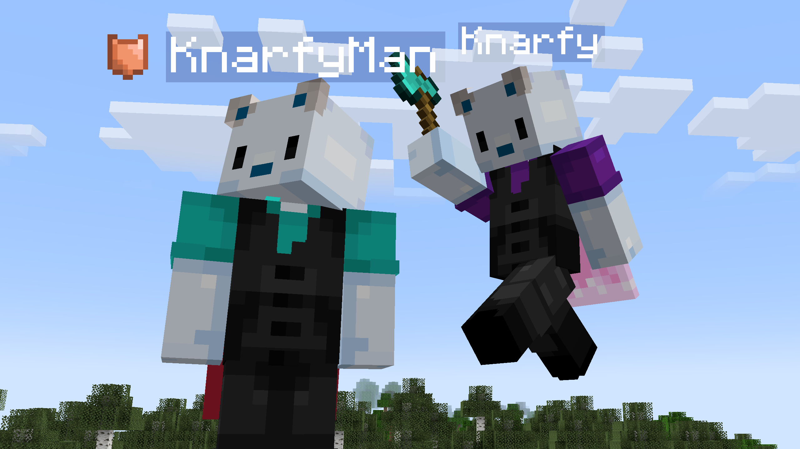

# Defense

A mod designed to protect players from unwanted PvP interactions while still allowing PvP on servers!

    

# Features

This mod adds a button in the survival player inventory.

When checked on, the player is now immune to all PVP damages, including direct attacks, arrows, TNTs... and can't damage other players.

The button unchecks itself after 20 minutes. One minute before unchecking, the player is notified with a chat message:

If a player is immune to PVP, an icon will display next to its nametag:

You can change the icon you are displaying to others in the skin settings.

# License and credits

This mod is open-source and copyrighted under MIT licence. Full license [here](LICENSE).

