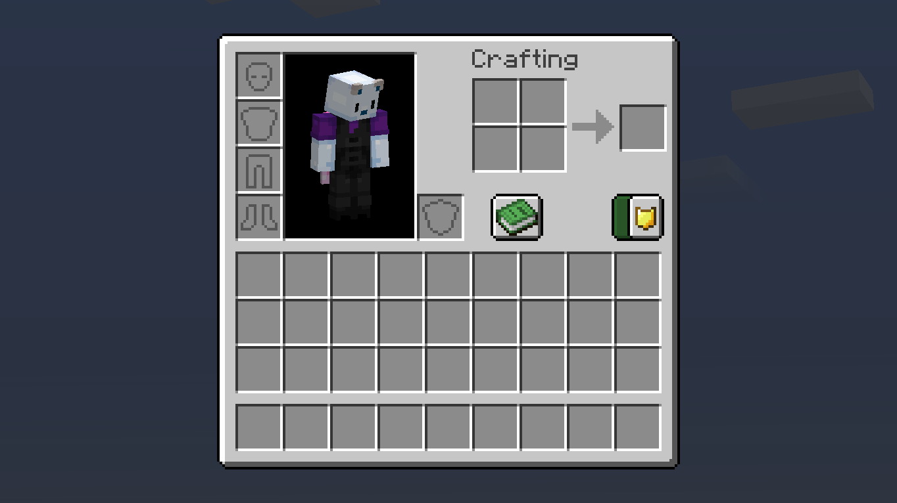
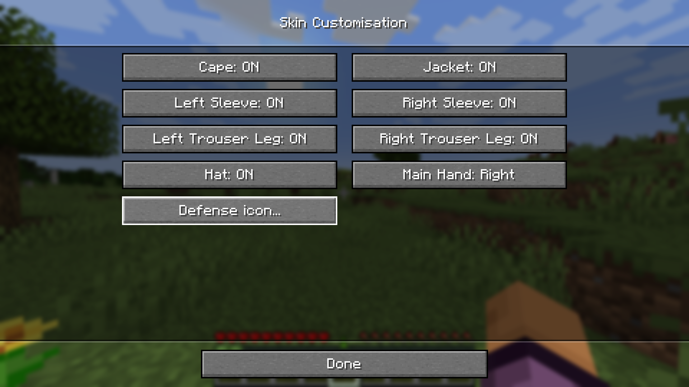
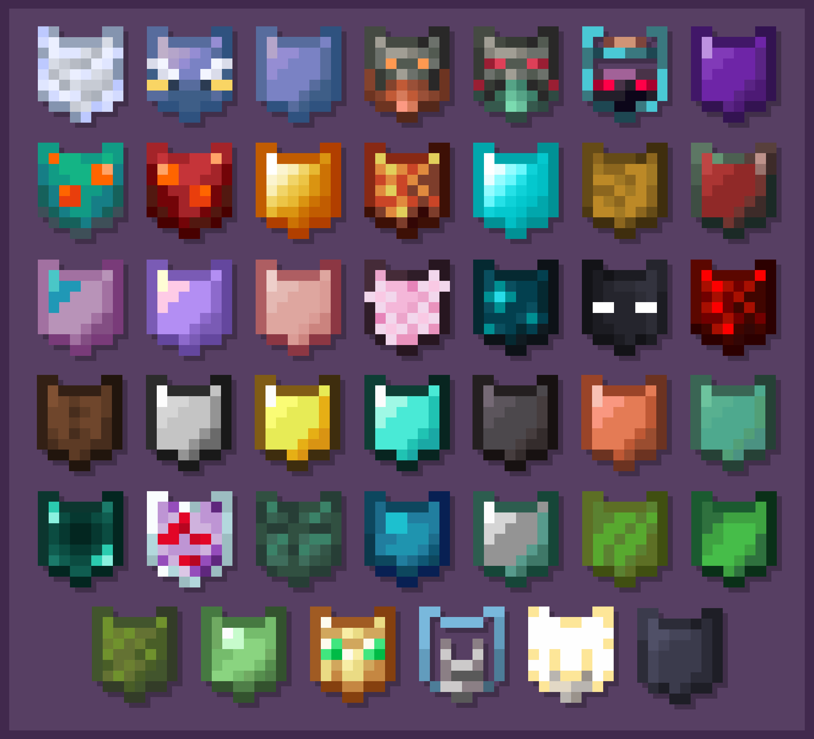

# Defense

A mod designed to protect players from unwanted PvP interactions while still allowing PvP on servers!

    

# Features

This mod adds a button in the survival player inventory.

When checked on, the player is now immune to all PVP damages, including direct attacks, arrows, TNTs... and can't damage other players.

The button unchecks itself after 20 minutes. One minute before unchecking, the player is notified with a chat message:

If a player is immune to PVP, an icon will display next to its nametag:

When a player stays AFK during one minute, the immunity turns on and a screen is displayed to the player:

You can change the icon you are displaying to others in the skin settings.

There are 41 icons available:

## Commands

### /defense
The defense command allows to modify targeted players' defense.
#### Syntax:
- `/defense (on|off|refresh)`
  Sets the player's defense according to the chosen action with the chosen value. Please note that `refresh` restarts the Defense timer, and `on` does not.
- `/defense <targets> (on|off|refresh)`
  Sets the targeted players' defense according to the chosen action with the chosen value. Please note that `refresh` restarts the Defense timer, and `on` does not.
#### Examples:
| Command                   | Description                                        |
|---------------------------|----------------------------------------------------|
| `/defense off`            | Turns off the player's defense                     |
| `/defense @a on`          | Turns on the defense of every player on the server |
| `/defense Knarfy refresh` | Resets Knarfy's defense                            |

### /afk
The afk command allows to immediately trigger the afk screen for the player executing the command.

## Gamerules

| Rule name                | Description                                       | Default value | Type    |
|--------------------------|---------------------------------------------------|---------------|---------|
| `petsProtected`          | Are pets protected by Defense                     | `true`        | Bool    |
| `mountsProtected`        | Are mounts protected by Defense                   | `true`        | Bool    |
| `afkTimerSeconds`        | Time before the Defense AFK screen in multiplayer | `60`          | Integer |
| `defenseDurationMinutes` | Defense effect duration                           | `20`          | Integer |
| `allowDefenseKeybind`    | Can the Defense keybind be used to toggle Defense | `false`       | Bool    |

# License and credits

This mod is open-source and copyrighted under MIT licence. Full license [here](LICENSE).

